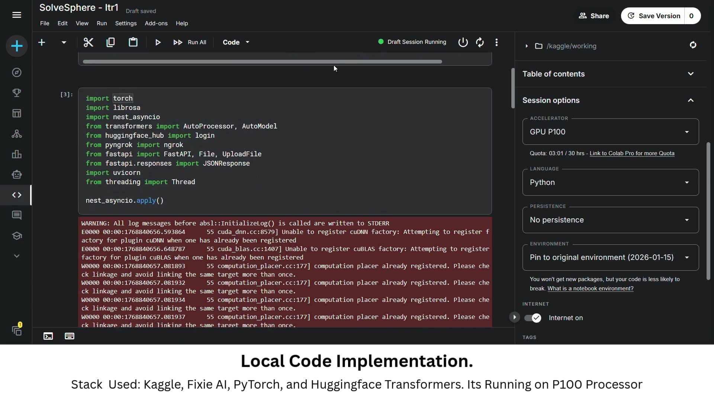

# SolveSphere AI

A voice-based customer support system powered by Ultravox AI, featuring real-time call management, escalation handling, and comprehensive analytics dashboard.

## 🎥 Demonstration Video

<div align="center">

<a href="Debuggers_P1.mp4" style="text-decoration: none; display: inline-block; position: relative;">
  
  <div style="position: relative; max-width: 800px; margin: 0 auto; border-radius: 12px; overflow: hidden; box-shadow: 0 8px 24px rgba(0,0,0,0.2);">
    
    
    
    <div style="position: absolute; top: 0; left: 0; right: 0; bottom: 0; background: rgba(0,0,0,0.3); display: flex; align-items: center; justify-content: center; transition: background 0.3s;">
      <div style="width: 80px; height: 80px; background: rgba(255,255,255,0.9); border-radius: 50%; display: flex; align-items: center; justify-content: center; box-shadow: 0 4px 12px rgba(0,0,0,0.3);">
        <div style="width: 0; height: 0; border-left: 28px solid #667eea; border-top: 18px solid transparent; border-bottom: 18px solid transparent; margin-left: 4px;"></div>
      </div>
    </div>
    
    <div style="position: absolute; bottom: 0; left: 0; right: 0; background: linear-gradient(to top, rgba(0,0,0,0.8), transparent); padding: 20px; color: white;">
      <div style="font-size: 20px; font-weight: bold; margin-bottom: 5px;">SolveSphere AI - Full Demonstration</div>
      <div style="font-size: 14px; opacity: 0.9;">Click to watch the complete video walkthrough</div>
    </div>
    
  </div>
  
</a>

<br>

**💡 Tip:** Click the video thumbnail above or open [`video_demo.html`](video_demo.html) for embedded playback

</div>

## 🚀 Features

- **Voice-Based Support**: Real-time voice interactions using Ultravox AI
- **Call Management**: Create, track, and manage customer support calls
- **Escalation System**: Automatic escalation to human agents when needed
- **Analytics Dashboard**: Real-time statistics, call history, and engagement metrics
- **Webhook Integration**: Real-time event tracking and call status updates

## 📋 Prerequisites

- Python 3.8+
- Ultravox API credentials
- Node.js (for frontend, if needed)

## ⚙️ Setup

1. **Install dependencies**:
   ```bash
   pip install -r requirements.txt
   ```

2. **Configure environment variables**:
   Create a `.env` file in the root directory:
   ```env
   ULTRAVOX_API_KEY=your_api_key
   ULTRAVOX_AGENT_ID=your_agent_id
   ULTRAVOX_API_BASE=https://api.ultravox.ai/api
   HOST=0.0.0.0
   PORT=8000
   WEBHOOK_BASE_URL=http://localhost:8000
   ```

3. **Start the server**:
   ```bash
   cd backend
   python main.py
   ```

4. **Access the dashboard**:
   Open your browser and navigate to `http://localhost:8000`

## 📁 Project Structure

```
Hackathon-Tcs/
├── backend/              # FastAPI backend server
│   ├── main.py          # Main application entry point
│   ├── config.py        # Configuration management
│   └── database.py      # Database operations
├── frontend/            # Web dashboard
│   ├── index.html       # Main HTML file
│   ├── app.js          # Frontend JavaScript
│   └── styles.css      # Styling
├── Debuggers_P1.mp4    # Demonstration video
└── requirements.txt    # Python dependencies
```

## 🔧 API Endpoints

- `POST /api/calls` - Create a new call
- `GET /api/calls` - List all calls
- `GET /api/calls/{call_id}` - Get call details
- `POST /api/webhook` - Receive webhook events from Ultravox
- `POST /api/tools/escalate_to_human` - Escalate call to human agent
- `POST /api/tools/log_call_engagement` - Log call engagement metrics

## 📊 Dashboard Features

- **Start New Call**: Initiate voice support sessions
- **Live Statistics**: Real-time call metrics and analytics
- **Call History**: Complete history of all support calls
- **Escalations**: Track and manage escalated calls
- **Engagement Logs**: Monitor customer engagement metrics
- **Webhook Activity**: View real-time webhook events

## 🛠️ Technologies Used

- **Backend**: FastAPI, Python, SQLite
- **Frontend**: HTML, CSS, JavaScript
- **Voice AI**: Ultravox API
- **Database**: SQLite (ultravox.db)

## 📝 License

This project was developed for the TCS Hackathon.
